# Relatório – Controle de Fluxo com BRAM e FIFO  
**Disciplina:** Lógica Reconfigurável – Engenharia de Computação (UTFPR) 
**Aluno:** Felipe Costa Santos

## 1. Objetivo

Implementar e validar um sistema de controle de fluxo entre dois blocos de memória utilizando uma FIFO como buffer intermediário. O sistema deve atender aos seguintes requisitos:

- BRAM de origem preenchida com valores crescentes de 0 a 2047;
- Transferência dos dados da BRAM de origem para a BRAM de destino;
- Escrita na FIFO ocorrendo a uma taxa **7 vezes maior** que a leitura;
- Controle de fluxo baseado na ocupação da FIFO:
  - pausa da escrita em 75% da capacidade;
  - retomada em 50%.

## 2. Procedimentos adotados

### 2.1 Validação dos blocos individuais

Foram implementados e testados separadamente:

- **BRAM (2048 x 8 bits)**  
  Escrita síncrona, leitura direta e reset responsável pela inicialização. A simulação confirmou o correto armazenamento e leitura dos dados.

- **Simulação da BRAM**:  
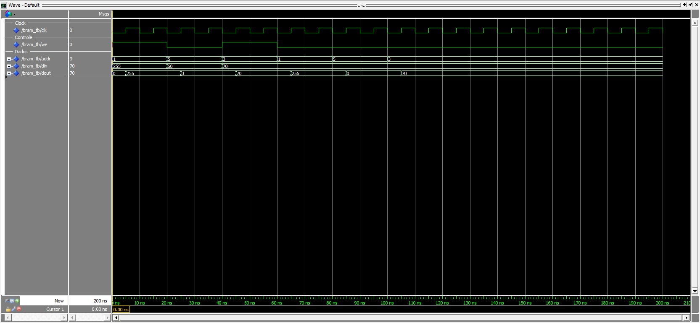

- **FIFO (1024 x 8 bits)**  
  Implementada com controle por ponteiros e contador de ocupação. Foram verificados o funcionamento dos sinais `full`, `empty` e `usedw`, além da preservação da ordem dos dados.

- **Simulação da FIFO**:  
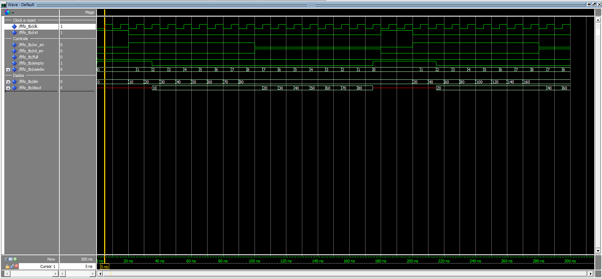

### 2.2 Integração do sistema completo

Os blocos foram integrados formando o seguinte fluxo:

**BRAM origem → FIFO → BRAM destino**

O controlador implementado foi responsável por:

- Gerar endereços de leitura e escrita;
- Controlar `wr_en` e `rd_en`;
- Monitorar a ocupação da FIFO (`usedw`);
- Garantir a razão de velocidade 7:1;
- Sinalizar o término da operação (`done`).

A leitura foi desacelerada por um contador, permitindo uma operação a cada 7 ciclos de clock.

## 3. Detalhes de implementação

### 3.1 BRAM

- Memória implementada como vetor interno;
- Escrita síncrona na borda de subida do clock;
- Leitura combinacional;
- Uso de `generic` para inicialização:
  - sequência crescente (origem);
  - valores zerados (destino).

### 3.2 FIFO

- Estrutura baseada em:
  - memória interna;
  - ponteiros de leitura e escrita;
  - contador de ocupação;
- Atualização consistente do contador mesmo com operações simultâneas;
- Sinais derivados:
  - `full`, `empty`, `usedw`.

### 3.3 Controlador de fluxo

Duas máquinas de estado foram utilizadas:

#### Escrita
- `wr_reset → wr_load → wr_fifo → wr_wait → wr_fifo → wr_wait → ... → wr_done`
- Pausa quando `usedw ≥ 75%`;
- Retoma quando `usedw ≤ 50%`.

#### Leitura
- `rd_reset → rd_wait → rd_fifo → rd_done`
- Leitura condicionada à presença de dados;
- Frequência reduzida (1 leitura a cada 7 clocks).

## 4. Resultados da simulação

### 4.1 Visão geral da simulação

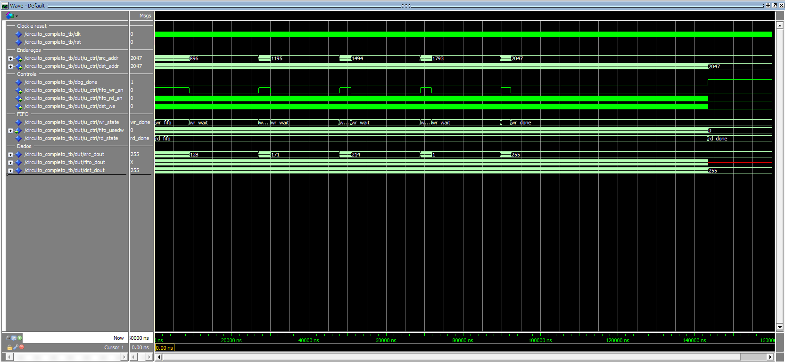  
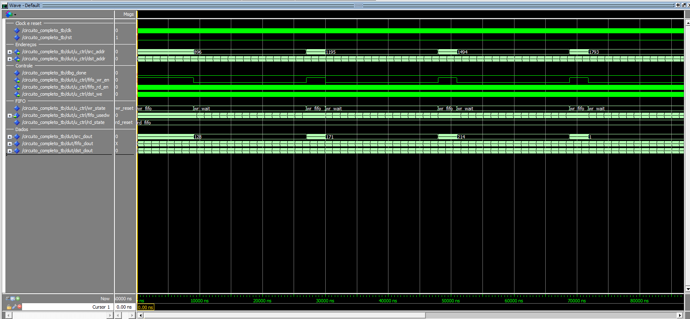  
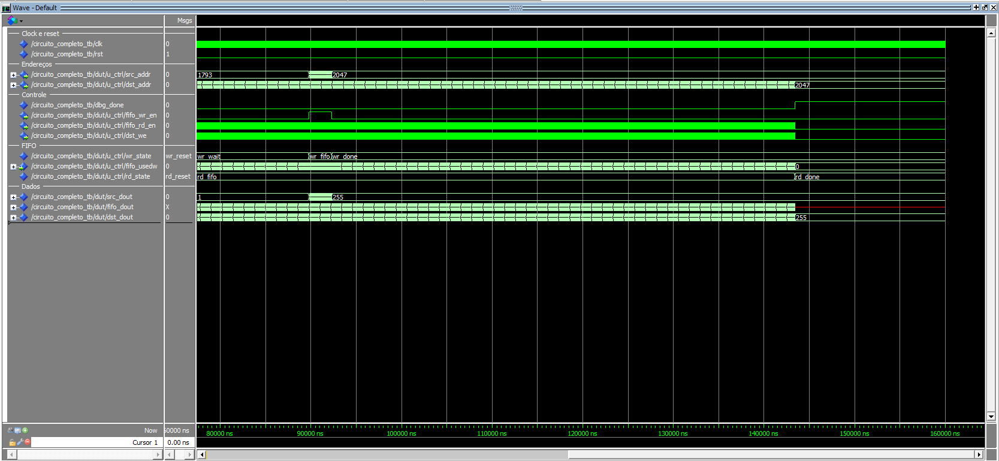

A primeira imagem resume toda a transferência em uma única visão. As outras duas apenas mostram a simulação com um pouco mais de zoom, principalmente para destacar os estados wr_fifo intermediários. Juntas, as três imagens mostram os endereços de origem e destino chegando ao último endereço, a alternância entre wr_fifo e wr_wait, a leitura acontecendo ao longo do processo e o encerramento com wr_done e rd_done. Essa é a melhor captura para entender o ciclo inteiro sem precisar analisar os detalhes finos.

### 4.2 Início da operação

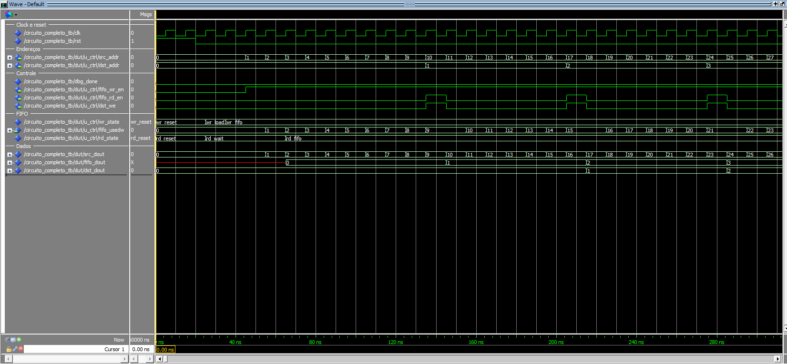

Aqui aparece o começo da operação logo após a liberação do reset. Dá para ver o controlador saindo de wr_reset, passando por wr_load e começando a alimentar a FIFO quando entra em wr_fifo. Ao mesmo tempo, a leitura sai de rd_reset para rd_wait, esperando a FIFO ter dados, e depois vai para rd_fifo no primeiro clock em que a FIFO já contém dados. Essa imagem é útil para entender o início do sistema.

### 4.3 Término da escrita

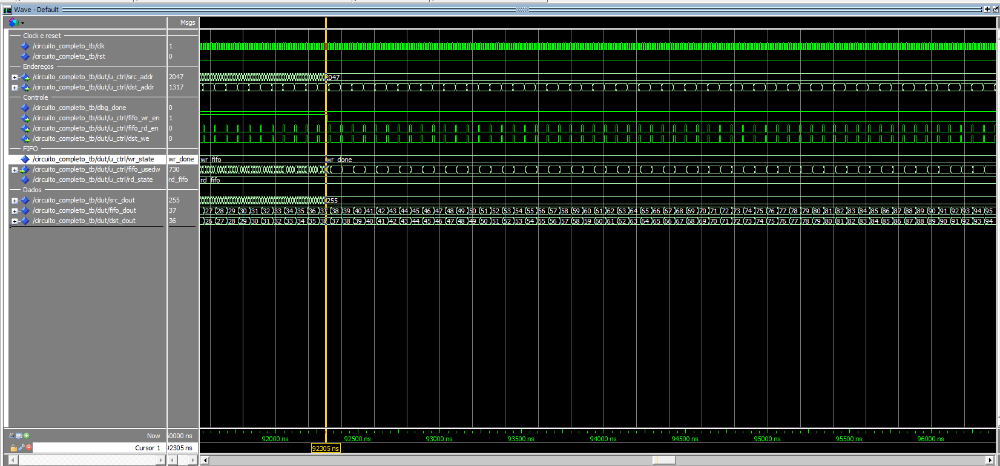

Essa captura marca o instante em que a BRAM de origem já chegou ao último endereço e a máquina de escrita passou para wr_done. Mesmo com a escrita encerrada, a FIFO ainda contém dados e a máquina de leitura continua em rd_fifo. Isso confirma que o sistema não para no momento da última escrita; ele segue até drenar a fila e transferir todos os dados da primeira BRAM para a segunda.

### 4.4 Término da leitura

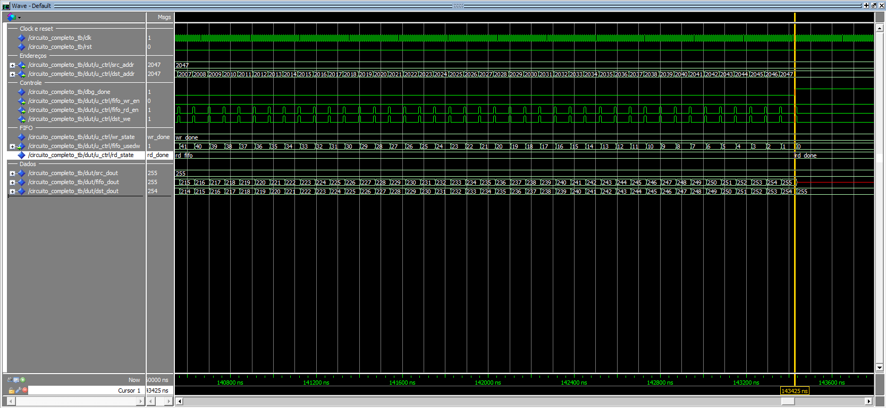

Aqui o circuito já finalizou a drenagem da FIFO e a máquina de leitura chegou a rd_done. O sinal dbg_done já indica término, o usedw está em zero e a BRAM de destino recebeu os valores até o último endereço. Essa é a imagem que comprova o fechamento completo do processo.

### 4.5 Limite superior da FIFO (75%)

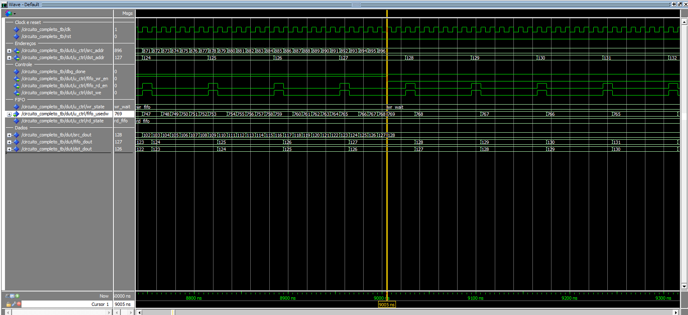

Esse zoom mostra a ocupação da FIFO crescendo até a faixa alta de controle, correspondente a 75% de uso da capacidade. Os valores de usedw sobem de forma contínua até a região em que o controlador precisa parar a escrita, e o sinal wr_wait aparece para impedir que a FIFO ultrapasse o limite superior.

### 4.6 Retomada da escrita (50%)

  
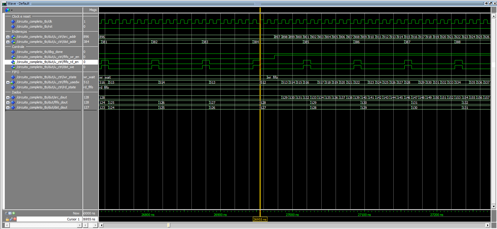  
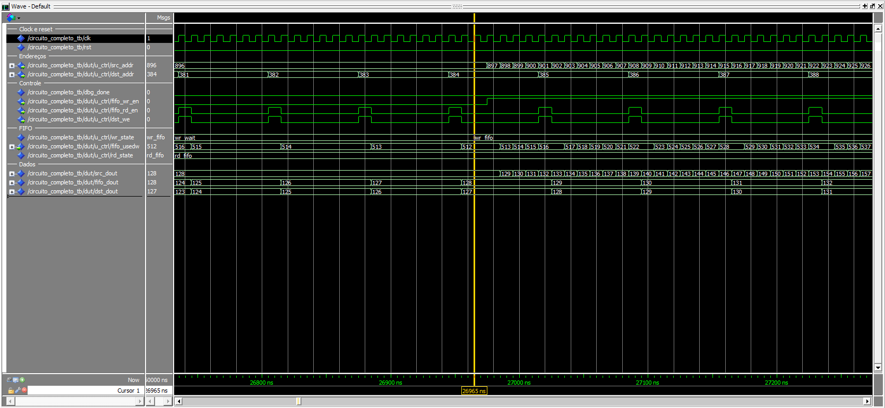  
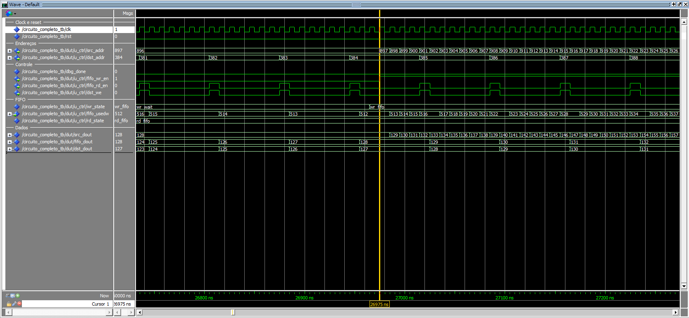  

Nessas imagens é mostrada a primeira vez em que a FIFO chega a 50% de ocupação, que é o limiar inferior definido no enunciado. Foi necessário usar cinco imagens para mostrar o tempo em que fifo_rd_en e dst_we ficam ativos, permitindo que a FIFO seja drenada apenas uma vez a cada 7 clocks. Também fica visível que, só no clock seguinte após a FIFO atingir 50% (512), a máquina de escrita sai de wr_wait e volta para wr_fifo. No clock seguinte, fifo_wr_en volta a ficar ativo e, no clock seguinte desse, a ocupação da FIFO começa a subir novamente. O controle de fluxo fica bem visível nessa sequência, mostrando a escrita saindo de parada para ativa.

## 5. Conclusão

O sistema implementado atende aos requisitos da atividade, demonstrando corretamente:

- uso de BRAM como armazenamento;
- uso de FIFO para desacoplamento de taxas;
- controle de fluxo baseado em ocupação;
- operação com diferentes velocidades de leitura e escrita.

A validação por simulação comprova o funcionamento correto tanto dos blocos individuais quanto do sistema integrado, evidenciando o comportamento esperado em todas as etapas da transferência de dados.